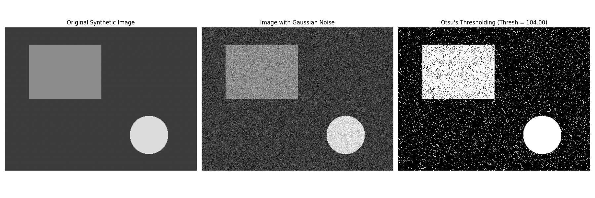
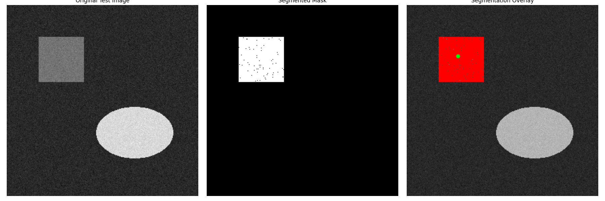

# Image Segmentation Techniques

A practical implementation of classic image segmentation algorithms in Python using OpenCV and NumPy. This repository provides clear, commented code for Otsu's thresholding and a custom iterative region growing method, designed for educational purposes and practical application.

<!--   -->
<!-- **Action:** Create a side-by-side comparison image of your best Otsu and Region Growing results, upload it to your repo (e.g., in a new '.github/assets' folder), and replace this link. -->

---

## 📖 Table of Contents

- [Overview](#-overview)
- [Algorithms Implemented](#-algorithms-implemented)
  - [1. Otsu's Binarization](#1-otsus-binarization)
  - [2. Region Growing](#2-region-growing)
- [File Structure](#-file-structure)
- [Installation](#-installation)
- [Usage](#-usage)

## 🎯 Overview

Image segmentation is a critical step in computer vision, involving the partitioning of a digital image into multiple segments (sets of pixels, also known as objects). This process simplifies the representation of an image, making it easier to analyze. This repository explores two fundamental approaches:

1.  **Thresholding-based Segmentation:** Classifies pixels based on their intensity relative to a given threshold.
2.  **Region-based Segmentation:** Groups pixels into regions based on their similarity and proximity.

## 🧠 Algorithms Implemented

### 1. Otsu's Binarization

Otsu's method is a powerful technique for automatic image thresholding. It is particularly effective for images that contain two classes of pixels (e.g., foreground and background) by finding the threshold that minimizes the intra-class variance.

-   **Key Concept:** Analyzes the image's histogram to find the optimal separation point between bimodal distributions.
-   **Implementation:** The demonstration creates a synthetic image with three intensity levels, adds Gaussian noise to create overlapping distributions, and then successfully applies Otsu's method to find the ideal threshold.
-   **Source Code:** [`task1_otsu.py`](./task1_otsu.py)

**Result:**

<!-- **Action:** Upload your 'task1_comparison.png' and replace this link. -->

### 2. Region Growing

Region growing is an iterative, seed-based approach to segmentation. It starts from one or more user-defined "seed" points and expands to include neighboring pixels that satisfy a homogeneity criterion (in this case, intensity similarity).

-   **Key Concept:** Groups pixels based on similarity and connectivity, starting from an initial point.
-   **Implementation:** A custom, non-recursive algorithm that uses a queue (first-in, first-out) to process pixels. It segments objects based on their intensity proximity to the average intensity of the initial seed(s).
-   **Source Code:** [`task2_region_growing.py`](./task2_region_growing.py)

**Result:**

<!-- **Action:** Upload one of your region growing result composites and replace this link. -->

## 📁 File Structure

```
.
├── results/
│   ├── task-1/
│   │   ├── synthetic_original.png
│   │   ├── synthetic_noisy.png
│   │   ├── synthetic_noisy_histogram.png
│   │   └── synthetic_otsu_thresholded.png
│   └── task-2/
│       ├── region_growing_test_image.png
│       ├── segmentation_results_rectangle.png
│       └── segmentation_results_ellipse.png
├── task1_otsu.py
├── task2_region_growing.py
├── Assignment2_Report.pdf  (Optional)
└── README.md
```

## 🛠️ Installation

To run the scripts, first clone this repository and then install the required Python libraries.

**1. Clone the repository:**
```bash
git clone https://github.com/[YOUR_USERNAME]/Python-Image-Segmentation-Techniques.git
cd Python-Image-Segmentation-Techniques
```

**2. Install dependencies:**
A virtual environment is recommended.
```bash
# Create a virtual environment (optional but good practice)
python -m venv venv
source venv/bin/activate  # On Windows, use `venv\Scripts\activate`

# Install required libraries
pip install opencv-python numpy matplotlib
```

## 🚀 Usage

Both Python scripts are designed to be run directly. They will generate synthetic images, perform segmentation, display the results using Matplotlib, and save output files to the `results/` directory.

**To run the Otsu's Method demonstration:**
```bash
python task1_otsu.py
```

**To run the Region Growing demonstration:**
```bash
python task2_region_growing.py
```
The scripts are self-contained and do not require external images, as they generate their own test cases.

