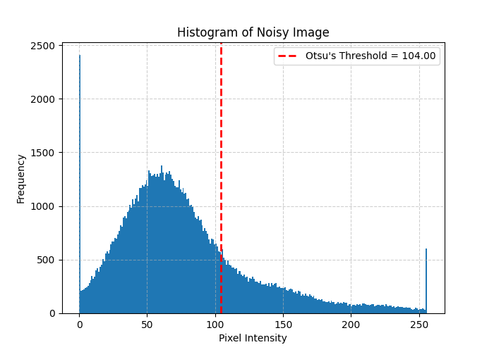
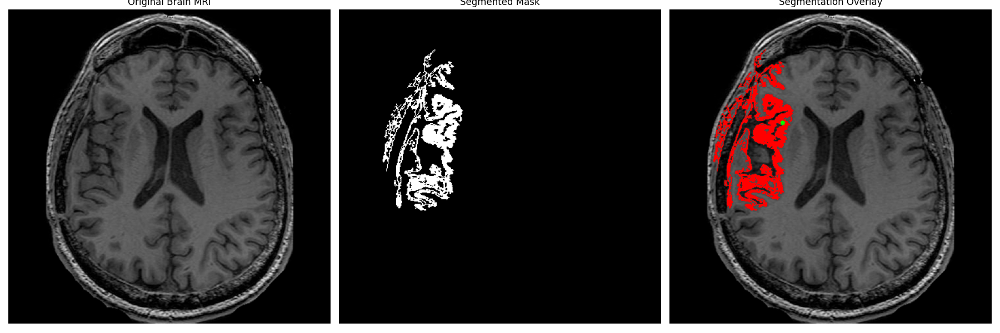
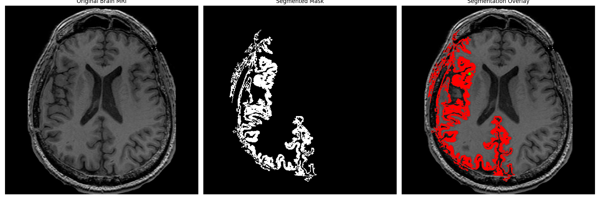
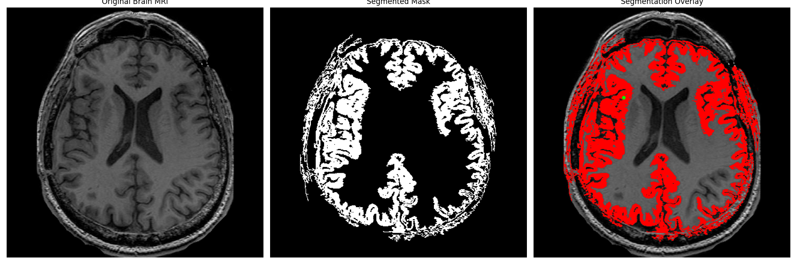
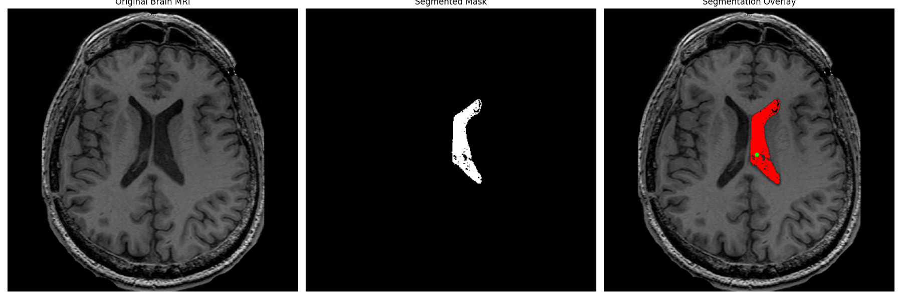

# Image Segmentation Techniques

A practical implementation of classic image segmentation algorithms in Python using OpenCV and NumPy. This repository provides clear, commented code for Otsu's thresholding and a custom iterative region growing method, designed for educational purposes and practical application on both synthetic and real-world medical images.

## Table of Contents

- [Results Showcase](#-results-showcase)
- [Overview](#-overview)
- [Algorithms Implemented](#-algorithms-implemented)
- [File Structure](#-file-structure)
- [Installation](#-installation)
- [Usage](#-usage)

## Results Showcase

### Otsu's Method on Synthetic Data

The algorithm successfully determines an optimal global threshold to segment objects from the background, even in the presence of noise that causes their intensity distributions to overlap. The histogram clearly shows the overlapping bimodal nature of the noisy image and the calculated threshold that separates the two main classes.

| Result Comparison | Noisy Image Histogram |
| :---: | :---: |
|  |  |

### Region Growing on Brain MRI

The effectiveness of region growing is highly sensitive to the `threshold` parameter. Below is a comparison of segmenting the brain's **gray matter** using different thresholds, demonstrating the importance of parameter tuning.

| Threshold | Result | Analysis |
| :---: | :---: | :--- |
| **13** |  | **Excellent Precision.** A very clean segmentation that accurately follows cortical folds with minimal leakage into other tissues. |
| **14** |  | **Optimal Balance.** Captures a comprehensive, connected region (good recall) while still preventing significant leakage (good precision). The best trade-off. |
| **15** |  | **Good, but showing leakage.** A strong result that captures slightly more area than T=14 but shows the first minor signs of leaking into white matter. |
| **20** |  | **Over-segmented.** The threshold is too lenient, causing significant leakage and loss of detail. |

**Final Selections:**
- **Gray Matter:** The optimal result was achieved with a threshold of **14**.
- **White Matter:** The algorithm was also successful at segmenting the brighter white matter tissue. As white matter is generally more uniform in intensity than gray matter in T1-weighted MRIs, a well-chosen seed and a moderately strict threshold can effectively isolate specific tracts, as shown below.



---

## Overview

Image segmentation is a critical step in computer vision, involving the partitioning of a digital image into multiple meaningful segments or objects. This process simplifies image representation for easier analysis. This repository explores two fundamental approaches:

1.  **Thresholding-based Segmentation:** Classifies pixels based on their intensity relative to a globally optimal threshold.
2.  **Region-based Segmentation:** Groups pixels into regions based on their similarity and proximity, starting from initial seed points.

## Algorithms Implemented

### 1. Otsu's Binarization

Otsu's method is a powerful technique for automatic image thresholding. It is particularly effective for images that contain two classes of pixels (e.g., foreground and background) by finding the threshold that minimizes the intra-class variance.

-   **Key Concept:** Analyzes the image's histogram to find the optimal separation point between bimodal distributions.
-   **Source Code:** [`task1_otsu.py`](./task1_otsu.py)

### 2. Region Growing

Region growing is an iterative, seed-based approach to segmentation. It starts from one or more user-defined "seed" points and expands to include neighboring pixels that satisfy a homogeneity criterion (in this case, intensity similarity).

-   **Key Concept:** Groups pixels based on similarity and connectivity. Its success is highly dependent on seed selection and the chosen similarity threshold.
-   **Source Code:** [`task2_region_growing.py`](./task2_region_growing.py)

## File Structure

```
.
├── input/
│   └── brain_image.jpg
├── results/
│   ├── task-1/
│   │   ├── task1_comparison.png
│   │   └── ... (other Otsu results)
│   └── task-2/
│       ├── segmentation_results_gray_matter_13.png
│       ├── segmentation_results_gray_matter_14.png
│       ├── segmentation_results_gray_matter_15.png
│       ├── segmentation_results_gray_matter_20.png
│       ├── segmentation_results_white_matter.png
│       └── ... (other overlay and mask files)
├── task1_otsu.py
├── task2_region_growing.py
├── Assignment2_Report.pdf
└── README.md
```

## Installation

To run the scripts, first clone this repository and then install the required Python libraries.

**1. Clone the repository:**
```bash
git clone https://github.com/PasanAbeysekara/Image-Segmentation-Techniques.git
cd Image-Segmentation-Techniques
```

**2. Install dependencies:**
A virtual environment is recommended.
```bash
# Create and activate a virtual environment
python -m venv venv
source venv/bin/activate  # On Windows, use `venv\Scripts\activate`

# Install required libraries
pip install opencv-python numpy matplotlib
```

## 🚀 Usage

The Python scripts are designed to be run directly. They will generate/load images, perform segmentation, display the results using Matplotlib, and save output files to the `results/` directory.

**To run the Otsu's Method demonstration:**
```bash
python task1_otsu.py
```

**To run the Region Growing demonstration on the brain MRI:**
*   Ensure `brain_image.jpg` is in the `input/` folder.
*   Update the image path inside `task2_region_growing.py` to `input/brain_image.jpg`.
*   You can change the `threshold_val` inside the script to generate different results.
*   Run the script:
```bash
python task2_region_growing.py 
```
