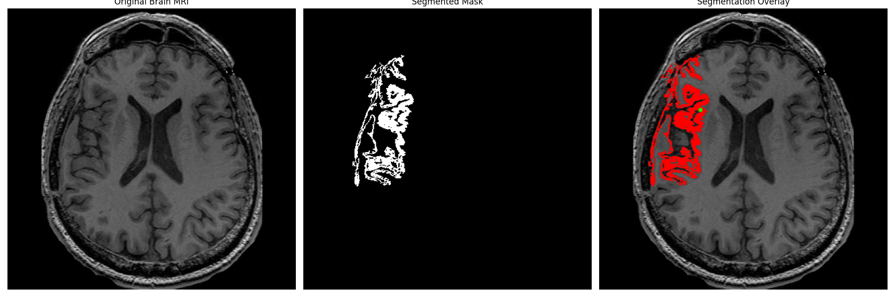

# Image Segmentation Techniques

A practical implementation of classic image segmentation algorithms in Python using OpenCV and NumPy. This repository provides clear, commented code for Otsu's thresholding and a custom iterative region growing method, designed for educational purposes and practical application on both synthetic and real-world medical images.


## 📖 Table of Contents

- [Overview](#-overview)
- [Algorithms Implemented](#-algorithms-implemented)
  - [1. Otsu's Binarization](#1-otsus-binarization)
  - [2. Region Growing](#2-region-growing)
- [File Structure](#-file-structure)
- [Installation](#-installation)
- [Usage](#-usage)
- [Results Showcase](#-results-showcase)

## 🎯 Overview

Image segmentation is a critical step in computer vision, involving the partitioning of a digital image into multiple meaningful segments or objects. This process simplifies image representation for easier analysis. This repository explores two fundamental approaches:

1.  **Thresholding-based Segmentation:** Classifies pixels based on their intensity relative to a globally optimal threshold.
2.  **Region-based Segmentation:** Groups pixels into regions based on their similarity and proximity, starting from initial seed points.

The implementations are tested on a synthetic image with noise and a real-world T1-weighted brain MRI scan to demonstrate their effectiveness in different scenarios.

## 🧠 Algorithms Implemented

### 1. Otsu's Binarization

Otsu's method is a powerful technique for automatic image thresholding. It is particularly effective for images that contain two classes of pixels (e.g., foreground and background) by finding the threshold that minimizes the intra-class variance.

-   **Key Concept:** Analyzes the image's histogram to find the optimal separation point between bimodal distributions.
-   **Demonstration:** Creates a synthetic image, adds Gaussian noise to create overlapping distributions, and then successfully applies Otsu's method to find the ideal threshold.
-   **Source Code:** [`task1_otsu.py`](./task1_otsu.py)

### 2. Region Growing

Region growing is an iterative, seed-based approach to segmentation. It starts from one or more user-defined "seed" points and expands to include neighboring pixels that satisfy a homogeneity criterion (in this case, intensity similarity).

-   **Key Concept:** Groups pixels based on similarity and connectivity. Its success is highly dependent on seed selection and the chosen similarity threshold.
-   **Demonstration:** Applied to a brain MRI to segment different tissue types (gray matter and white matter). The repository showcases the process of tuning the `threshold` parameter to achieve an optimal result.
-   **Source Code:** [`task2_region_growing.py`](./task2_region_growing.py)

## 📁 File Structure

```
.
├── input/
│   └── brain_image.jpg
├── results/
│   ├── task-1/
│   │   ├── task1_comparison.png
│   │   ├── synthetic_noisy.png
│   │   ├── synthetic_noisy_histogram.png
│   │   └── synthetic_original.png
│   └── task-2/
│       ├── brain_mri_original.png
│       ├── segmentation_overlay_gray_matter.png
│       ├── segmentation_overlay_white_matter.png
│       ├── segmentation_results_gray_matter_13.png
│       ├── segmentation_results_gray_matter_15.png
│       ├── segmentation_results_gray_matter_20.png
│       ├── segmentation_results_white_matter.png
│       ├── segmented_mask_gray_matter.png
│       └── segmented_mask_white_matter.png
├── task1_otsu.py
├── task2_region_growing.py
├── Assignment2_Report.pdf
└── README.md
```

## 🛠️ Installation

To run the scripts, first clone this repository and then install the required Python libraries.

**1. Clone the repository:**
```bash
git clone https://github.com/PasanAbeysekara/Image-Segmentation-Techniques.git
cd Image-Segmentation-Techniques
```

**2. Install dependencies:**
A virtual environment is recommended.
```bash
# Create and activate a virtual environment
python -m venv venv
source venv/bin/activate  # On Windows, use `venv\Scripts\activate`

# Install required libraries
pip install opencv-python numpy matplotlib
```

## 🚀 Usage

The Python scripts are designed to be run directly. They will generate/load images, perform segmentation, display the results using Matplotlib, and save output files to the `results/` directory.

**To run the Otsu's Method demonstration:**
```bash
python task1_otsu.py
```

**To run the Region Growing demonstration on the brain MRI:**
*   Ensure `brain_image.jpg` is in the `input/` folder.
*   Update the image path inside `task2_region_growing.py` to `input/brain_image.jpg`.
*   Run the script:
```bash
python task2_region_growing.py 
```

## 🖼️ Results Showcase

### Otsu's Method on Synthetic Data

The algorithm successfully determines an optimal global threshold to segment objects from the background, even in the presence of noise that causes their intensity distributions to overlap.


### Region Growing on Brain MRI

The effectiveness of region growing is highly sensitive to the `threshold` parameter. Below is a comparison of segmenting the brain's gray matter using different thresholds, demonstrating the importance of parameter tuning.

| Threshold | Result | Analysis |
| :--- | :--- | :--- |
| **13** |  | **Excellent Precision.** Very clean segmentation that accurately follows cortical folds with minimal leakage into white matter. |
| **15** |  | **Good Balance.** A strong result that captures slightly more area than T=13 but shows the first minor signs of leakage. |
| **20** |  | **Over-segmented.** The threshold is too lenient, causing significant leakage into the white matter and loss of detail. |

**Final Selections:**
The optimal result for gray matter was achieved with a threshold between 13 and 15. The algorithm was also successful at segmenting the brighter white matter with a different seed and a tuned threshold.


